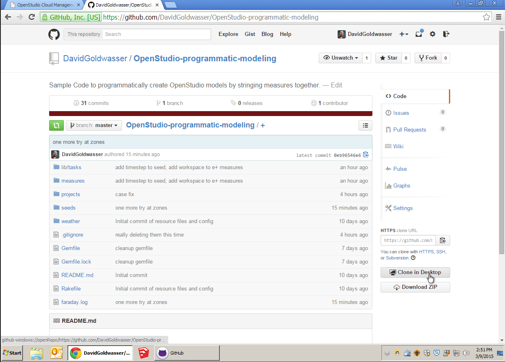
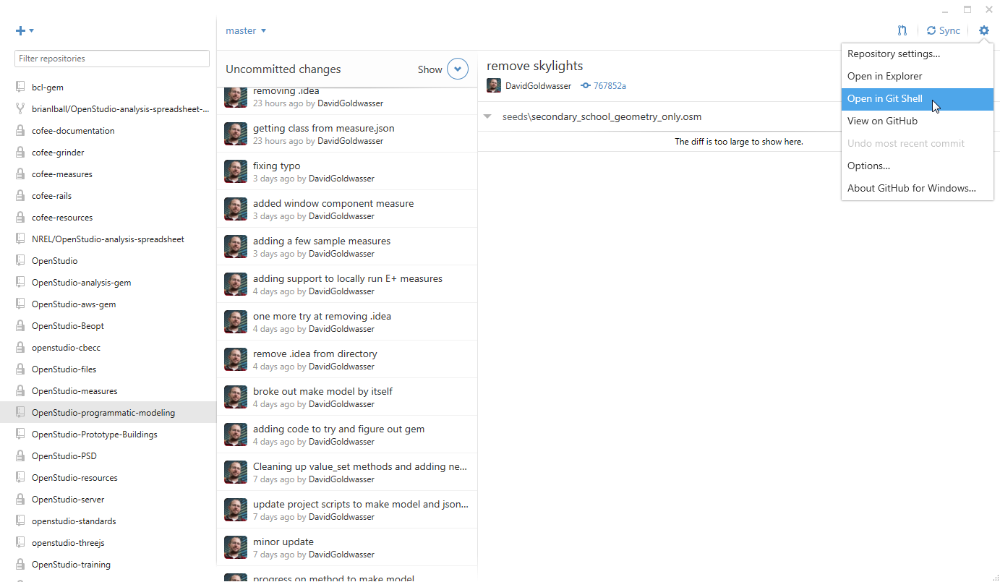
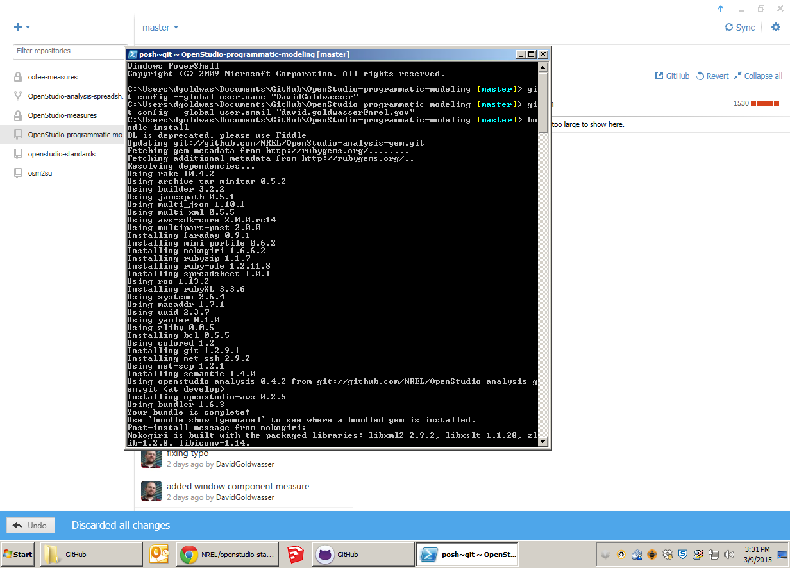
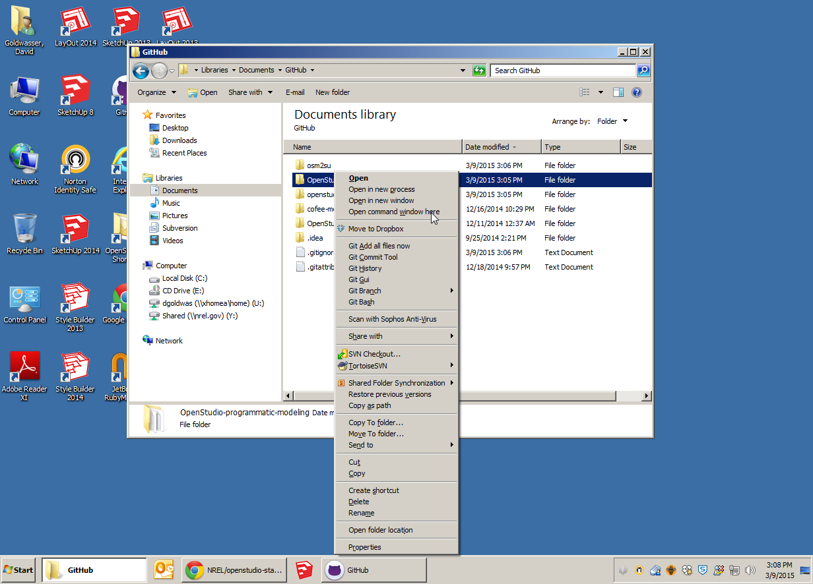
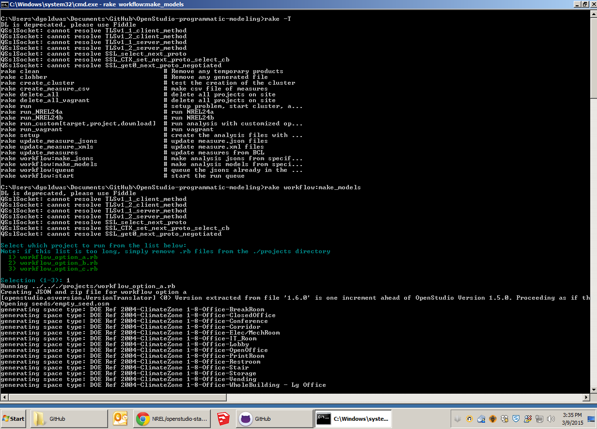

# OpenStudio-programmatic-modeling
Sample Code to programmatically create OpenStudio models by stringing measures together.


## Layout
* analysis - These are the exported files that are uploaded to the cloud server to run.
* analysis_local - These are models and IDF made by local run of the measures.
* projects - List of projects in the form of analysis scripts. These are the file that you should edit and copy.
* seeds - Example seed OSM models.
* weather - Where to dump other weather files of interest.
* measures- Measures used in the workflow

## Instructions

* Install Ruby 2.0 based on instructions in the run tests section of the [OpenStudio Measure Training documentation](http://nrel.github.io/OpenStudio-user-documentation/measures/measure_writing_guide/#running-the-measure-tests) .
* Also make sure site folder in ruby has path to OpenStudio (For now this is needed to run measures locally)

* Clone this repository to your computer.




* Open repository in GitShell




* Configure Git username and email address, as described [here](https://help.github.com/articles/set-up-git/)
* Install Bundle

```ruby
bundle install
```




* Open Command window using command prompt




* Use rake -T to see possible commands. Example below then uses rake workflow:make_models

```ruby
rake -T
```

```
rake workflow:make_models
```




## Summary of Relevant Rake Methods

### rake update_measure_jsons
* These are needed by make_json and make_models.
* Run this if you add or remove arguments to your measure.

### rake workflow:make_jsons
* User prompt to select .rb file to run.
* This populates the analysis directory with files need to run an analysis on the server.
* The zip file contains the seed model, weather file, measures and other resources that will be pushed to the server later.

### rake_workflow:make_models
* User prompt to select .rb file to run.
* This Populates the analysis_local directory with OSM and IDF files.
* In the current state this requires OpenStudio. In the future this will use the openstudio-analysis gem instead.

### rake workflow:queue_populate
* This will push all the files in the analysis directory up to a server in the location configured in the run.rake file. This only sets up a single datapoint analysis.

### rake workflow:queue_start
* This will start all of the jobs that hare already been put in the queue on the server.

### rake workflow:run_jsons
* This will take all analysis json files and start an analysis. It can be used for multi-datapoint analyses. It is currently setup to create an analysis for each analysis json it finds. 

## Configuring the run.rake file
Currently the "lib/tasks/run.rake" file is used to determine the type of analysis. This will probably be moved to a better location for user editing, or maybe will be in each .rb file in the project directory. These are the only constants in the file that should be edited as needed.

```ruby
# set constants
ANALYSIS_TYPE = 'single_run'
HOSTNAME = 'http://localhost:8080'
```
